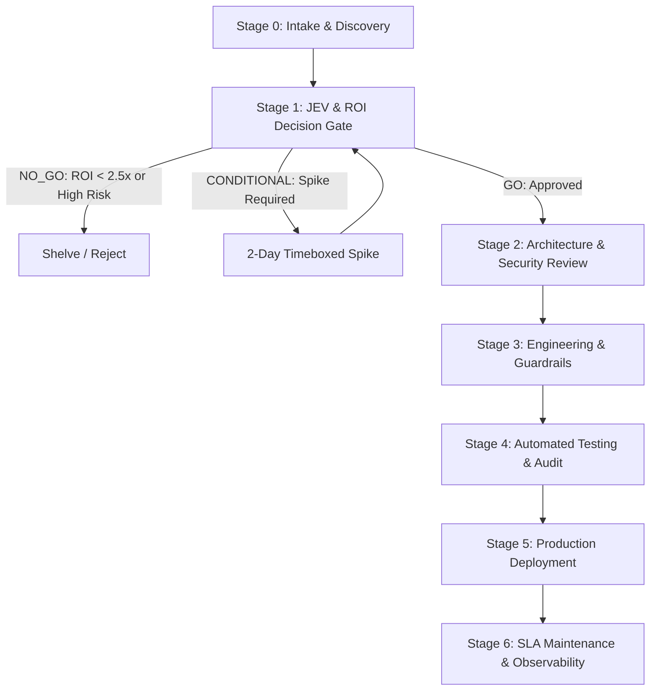

# Software Development Life Cycle (SDLC) Playbook
## Engineering Standards & Quality Gates — yokBangun

---

## 1. Overview & Core Philosophy

SDLC di `yokBangun` dirancang dengan prinsip **"ROI-First, Zero-Surprises, Safe-by-Default"**. 
Tidak ada baris kode yang ditulis sebelum inisiatif lolos **Decision Layer (JEV)**, dan tidak ada rilis ke produksi sebelum melewati **Quality & Security Guardrails**.



---

## 2. The 6-Stage SDLC Gates

### Stage 0: Opportunity & Problem Intake
- Pengumpulan kebutuhan klien atau inisiatif internal.
- Definisi masalah nyata: Berapa jam kerja yang terbuang? Berapa potensi omzet yang hilang?
- Menghindari perangkap "solusi mencari masalah" (*solution looking for a problem*).

### Stage 1: JEV (Justified Expected Value) & ROI Gate
Setiap fitur, modul AI, atau refactoring arsitektur dihitung secara kuantitatif menggunakan formula JEV:
$$\text{JEV} = (\text{P(Success)} \times \text{Expected Value}) - (\text{P(Failure)} \times \text{Downside Risk}) - \text{TCO}$$

**Kriteria Keputusan:**
- **GO:** JEV > 0, Risk-Adjusted ROI $\ge$ 2.5x (250%), dan risiko keamanan terkendali.
- **CONDITIONAL (SPIKE):** ROI $\ge$ 1.8x, namun tingkat keyakinan (*confidence*) masih di bawah 65%. Tim wajib melakukan *proof of concept* terikat waktu (maksimal 2 hari kerja) sebelum komitmen penuh.
- **NO-GO:** JEV $\le$ 0, ROI < 1.8x, atau keputusan satu arah (*Type 1 Irreversible*) dengan risiko tinggi.

### Stage 2: Architecture & Threat Modeling
- Penentuan apakah keputusan bersifat **Type 1 (Irreversible)** atau **Type 2 (Reversible)**.
- Validasi batasan keamanan: Apakah ada endpoint publik baru? Wajib pasang rate limit dan ukuran payload.
- Validasi tema: Wajib mematuhi desain **Light Theme Only** (`#FFFFFF` / `#F7F8F6`).

### Stage 3: Implementation with Built-in Guardrails
- **Branching Model:**
  - `main`: Branch produksi siap rilis. Selalu bersih, teruji, dan sinkron ke Vercel/GitHub.
  - `development`: Branch staging tempat integrasi fitur.
  - `feature/<nama-fitur>`: Branch kerja terisolasi.
- **Purity Check:**
  - TypeScript `strict: true`, zero `any`.
  - Dependency-free input validation (`features/contact/schema.ts`).
  - SSRF protection untuk outbound fetch (`lib/security/ssrfGuard.ts`).
  - In-memory rate limiting (`lib/security/rateLimit.ts`).

### Stage 4: Automated Testing & Verification
Sebelum pull request (PR) digabungkan, semua verifikasi wajib hijau:
```bash
# 1. Type Check
npx tsc --noEmit

# 2. Unit & Integration Tests (100% pass)
npm run test

# 3. Linter Check
npm run lint

# 4. Production Build Validation
npm run build
```
- **PWA & Mobile Testing:** Menjalankan flow Maestro (`.maestro/flows/`) untuk memverifikasi fungsionalitas UI pada viewport mobile.

### Stage 5: Zero-Downtime Deployment
- **Platform:** Vercel Edge Network dengan auto-rollback.
- **Header Keamanan:** HSTS (max-age 2 tahun), X-Content-Type-Options nosniff, Referrer Policy strict-origin, X-Frame-Options SAMEORIGIN.
- **DNS Sync:** Dynamic DNS task berjalan via Windows Task Scheduler mengarah ke IP publik aktif.

### Stage 6: Maintenance & Continuous Observability
- Pemantauan error log runtime pada Route Handlers (`/api/contact`, `/api/partnership`).
- Audit dependensi berkala (`npm audit`).
- Pembaruan SLA rutin bulanan untuk klien retainer.

---

## 3. Pull Request (PR) Checklist & Guardrails

Setiap PR harus memenuhi checklist berikut:
- [ ] Lolos evaluasi JEV (ROI $\ge$ 2.5x atau izin spike dari lead).
- [ ] Mempertahankan brand identity resmi: `yokBangun — growth with u`.
- [ ] Tidak menggunakan tema gelap (Light theme only).
- [ ] Bebas dari kata-kata robotik/AI hype text yang berlebihan.
- [ ] Endpoint publik dilindungi oleh rate limiter dan body size guardrail.
- [ ] Semua pengujian unit (`vitest run`) dan kompilasi TypeScript (`tsc`) lulus 100%.
